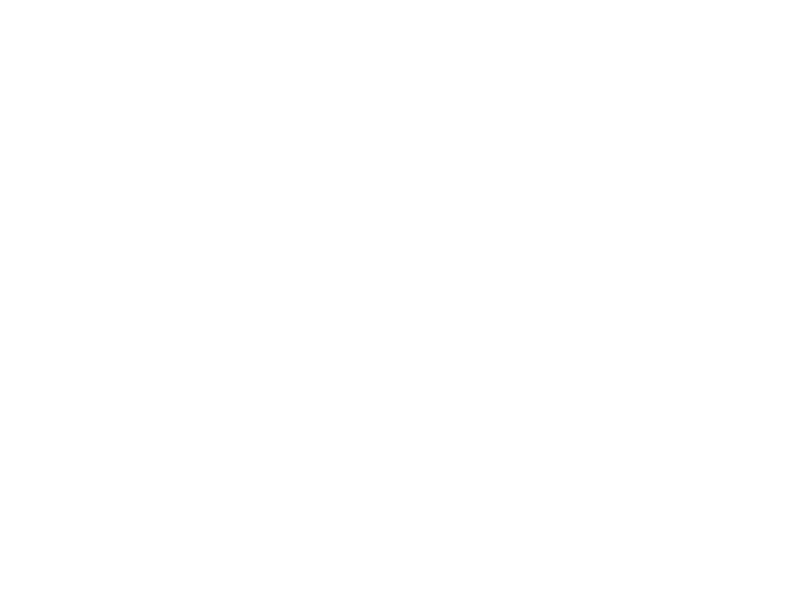
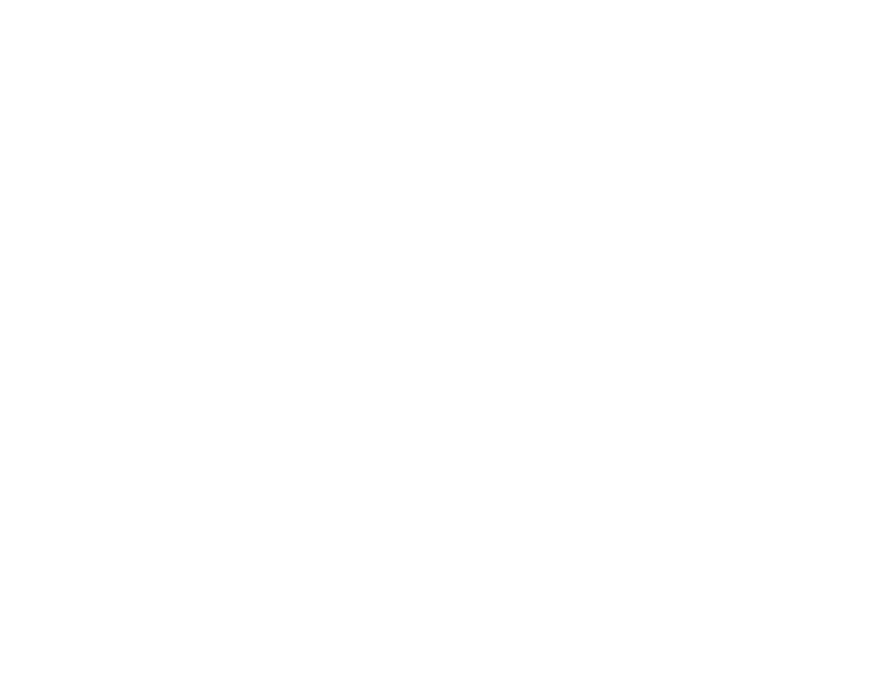

# Data Analysis 2 – Assignment 2 (Amsterdam Hotels)

## Overview
This repository contains my Assignment 2 analysis for Data Analysis 2.  
City analyzed: **Amsterdam** (non-Vienna) with **N = 424** hotels after filtering.

**Outcome variable**
- `highly_rated = 1` if `rating >= 4`, else `0`.
- In the final sample, the highly-rated share is about **0.512** (217/424).

## Data & Filtering
Hotel features and prices are loaded from the provided OSF links.  
Filtering (minimal / appropriate):
- keep Amsterdam only
- drop missing values in `rating`, `stars`, `distance`
- keep plausible ranges: rating 0–5, stars 0–5, distance ≥ 0
- remove duplicates by `hotel_id`

## Methods
I estimate three binary outcome models using `distance` and `stars`:
1. **Linear Probability Model (OLS)** with robust SE
2. **Logit**
3. **Probit**

I compare coefficients across models, and interpret non-linear models using **Average Marginal Effects (AMEs)** and predicted probabilities.

## Key Results (Amsterdam, N = 424)

### Regression coefficients (sign + significance)
- **Stars** is a strong positive predictor of being highly rated in all models:
  - LPM: **0.272***  
  - Logit: **1.492***  
  - Probit: **0.886***  
- **Distance to center** is small and not robust across models:
  - LPM: **0.018*** (weak significance)
  - Logit / Probit: positive but **not statistically significant**

### Average Marginal Effects (AME)
- **Stars (AME):** about **+0.268** (Logit and Probit), highly significant  
  → roughly a **26–27 percentage point** increase in the probability of being highly rated for a +1 star increase, on average.
- **Distance (AME):** about **+0.015** (Logit and Probit), **not significant**  
  → distance does not show a reliable relationship with being highly rated in this specification.

## Files
- Notebook: `da2-assignment-2-yllkeberisha.ipynb`
- Figures: `figures/`

---

## Appendix: Figures

### Figure 1 — Predicted probability vs distance (Logit)

### Figure 2 — Highly-rated share by stars

